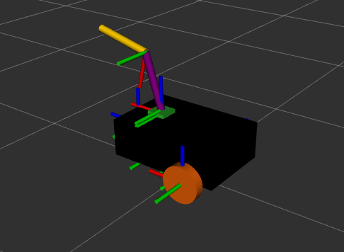
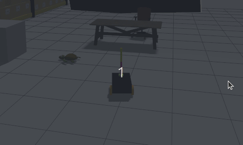

# ROS2 + Gazebo Mobile Manipulator Simulation

A differential-drive mobile robot with a 2-DOF arm, built from scratch in URDF/Xacro and simulated in Gazebo. A hands-on project to learn robot description and physics simulation in ROS2.

## Problem

Learn URDF/Xacro and Gazebo simulation by building a robot from scratch, rather than launching an existing package. Every link, joint, and plugin authored and debugged individually.

## Robot Design

- **Mobile base** — chassis, 2 differential-drive wheels, passive low-friction caster
- **Arm** — 3-link chain (`arm_base_link` → `forearm_link` → `hand_link`), `revolute` joints with limits and damping
- **Shared macros** — inertia tensors and materials factored into `common_properties.urdf.xacro`, reused across all links

## Simulation Stack

- **DiffDrive** — `cmd_vel` → wheel speeds
- **JointPositionController** — P-control per arm joint (`effort = p_gain × error`), gains tuned per joint
- **JointStatePublisher** — live joint angles, physics → ROS2
- **ros_gz_bridge** — topics bridged between Gazebo and ROS2 (clock, joints, tf, cmd_vel, arm commands)

\`\`\`bash
ros2 launch coach_robot_bringup my_robot_gazebo.launch.xml
\`\`\`

## Verification

Every stage checked visually in RViz before moving on — link placement and joint rotation direction confirmed against RViz's TF display, not just derived on paper.

\`\`\`bash
ros2 launch coach_robot_description display.launch.py
\`\`\`

## Visualization

## Visualization

## Limitations / Future Work

- P-control only, no full PID/LQR yet
- Minimal world — no obstacles yet (planned: SLAM + navigation follow-up)
- Simulation only, no physical hardware — not a digital twin
- Caster is a simplified fixed sphere, not a true swivel joint
